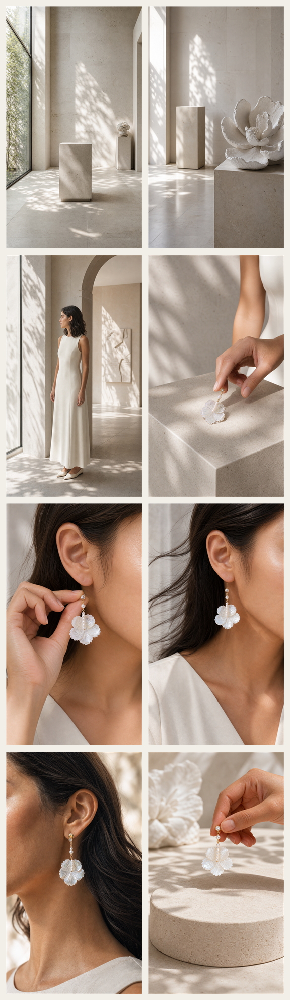

# 石中花影｜8 段首帧

本目录是 Seedance 分段生成的首帧参考，不把它当作一个连续长镜头。先用对应首帧锁定该段的空间、人物和产品状态；每段仍以 `../seedance-prompts.md` 的镜头、动作和声音约束为准。

| 段落 | 首帧 | 必须锁定的内容 | 首饰规则 |
| --- | --- | --- | --- |
| S01 | [S01](S01.png) | 高窗、空展厅、石灰岩调性 | 无首饰 |
| S02 | [S02](S02.png) | 石膏花雕塑与空展台 | 无首饰 |
| S03 | [S03](S03.png) | 模特进入空间，在主石台旁停下；保持中远景 | 无首饰 |
| S04 | [S04](S04.png) | 主石台上的一只耳环与将要取起它的手指 | 仅一只耳环，在石台上 |
| S05 | [S05](S05.png) | 手、耳垂与同一只耳环同框，准备扣合 | 仅一只耳环，在手中 |
| S06 | [S06](S06.png) | 手已离开；发丝带开后完整显露已佩戴耳环 | 仅一只已佩戴耳环 |
| S07 | [S07](S07.png) | 耳部微距、金属连接件—珍珠—贝母花瓣 | 仅一只耳环 |
| S08 | [S08](S08.png) | 空石台上方，手托着第一只耳环准备放下 | 第一只耳环在手中；第二只尚未入画 |

## 交接原则

- S01→S03：不出现任何首饰；S03 保持中远景，避免先把裸耳做成视觉重点。
- S03→S04：手停在石台边缘是动作切点；S04 开头的一只耳环已经明确放在台上。
- S04→S05：同一只耳环从指尖进入耳侧，S05 必须可见“靠近耳垂 → 扣合 → 手指松开”的完整动作。
- S05→S06：S06 承接 S05 已扣好的观察末帧，手不再进入；风只负责带开发丝，不负责让耳环出现。
- S06→S07：继续同一只耳环，镜头只从人物侧脸收紧到耳部微距。
- S07→S08：允许以贝母白色高光切到石台，但 S08 必须先可见地放下第一只，再由同一只手放下第二只，才形成成对落版。
