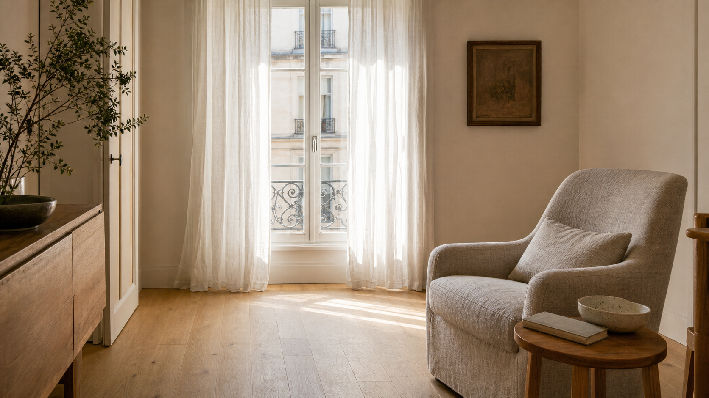

# ENV_MR_NATURAL_WINDOW_LINEN_APARTMENT_001｜自然窗边亚麻公寓

用于 Pearl Series 04 的可居住真实窗边环境。正向和反向锚点共同锁定窗、椅子、木桌、门与走位关系。

- [[VID_MR_PEARL_SERIES_04_NATURAL_WINDOW_001｜自然窗边重构]]
- 文件：`03-scene-kits/ENV_MR_NATURAL_WINDOW_LINEN_APARTMENT_001`
