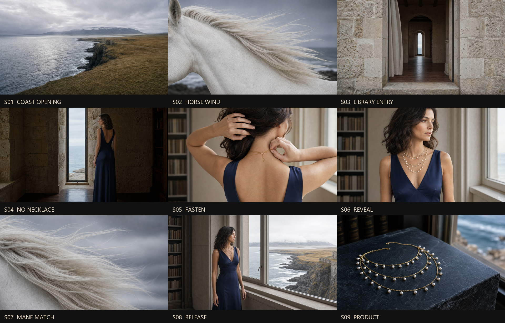

# VID_MR_COASTAL_LIBRARY_PEARL_NECKLACE_001｜海岸图书馆珍珠项链

36.8 秒、16:9 的原创 MythRealms 广告包。叙事从冷灰海崖进入图书馆，再由后颈真实扣合完成项链显露；白马只作为独立风感隐喻。

## 首帧预览

## 调用顺序

1. S01–S05 按编号独立生成并验收。
2. 保存 S05 验收末帧为 accepted-s05-last-frame.png，再开始 S06。
3. 保存 S06 验收末帧为 accepted-s06-last-frame.png，再开始 S08。
4. 剪辑严格按 36.8 秒剪辑合同；Logo 只在 S09 后期静态加入。

## 资产入口

- [资产清单](../../10-storyboard-videos/VID_MR_COASTAL_LIBRARY_PEARL_NECKLACE_001/asset-pack-manifest.json)
- [剪辑合同](../../10-storyboard-videos/VID_MR_COASTAL_LIBRARY_PEARL_NECKLACE_001/cut-map.md)
- [逐镜头提示词](../../10-storyboard-videos/VID_MR_COASTAL_LIBRARY_PEARL_NECKLACE_001/prompts/README.md)
- [首帧与连续性检查](../../10-storyboard-videos/VID_MR_COASTAL_LIBRARY_PEARL_NECKLACE_001/first-frames/README.md)
- [产品锁](../../01-products/PROD_MR_COASTAL_PEARL_CASCADE_NECKLACE_001/README.md)
- [角色锚点](../../05-characters/CHAR_MR_TALENT_COASTAL_LIBRARY_001/README.md)
- [空间锚点](../../03-scene-kits/ENV_MR_COASTAL_LIBRARY_001/README.md)
- [白马锚点](../../03-scene-kits/ANIMAL_MR_WHITE_HORSE_001/README.md)
- [后颈扣合锚点](../../06-reference-inputs/REF_MR_COASTAL_NECKLACE_FASTEN_001/README.md)
